# 02 — ER Diagram

Mermaid ER diagram. Renders on GitHub. Relationship notation: `||--o{` = one-to-many (optional many), `||--||` = one-to-one.

```mermaid
erDiagram
    COMPANY ||--o{ USERS : employs
    COMPANY ||--|| APP_SETTINGS : configures

    USERS ||--o{ AUDIT_LOGS : performs
    USERS ||--o{ POLICIES : creates
    USERS ||--o{ RETURNS : responsible
    USERS ||--o{ RETURN_VERSIONS : creates
    USERS ||--o{ SUBMISSIONS : submits
    USERS ||--o{ USER_NOTIFICATIONS : receives
    USERS ||--o{ NOTIFICATION_PREFERENCES : configures
    USERS ||--o{ ADJUSTMENTS : makes

    CLIENTS ||--o{ POLICIES : insured_by
    INSURERS ||--o{ POLICIES : underwrites
    INSURERS ||--o{ POLICY_REMITTANCES : receives
    RISK_CLASSES ||--o{ POLICIES : classifies

    POLICIES ||--o{ POLICY_COLLECTIONS : receives
    POLICIES ||--o{ POLICY_REMITTANCES : remits
    POLICIES ||--o{ RETURN_LINE_ITEMS : feeds

    STAFF_CATEGORIES ||--o{ STAFF : categorises

    RETURN_DEFINITIONS ||--o{ RETURN_TEMPLATES : defines
    RETURN_DEFINITIONS ||--o{ DUE_DATE_RULES : schedules
    RETURN_DEFINITIONS ||--o{ REGULATORY_CALENDAR : generates
    RETURN_DEFINITIONS ||--o{ RETURNS : instantiates

    RETURN_TEMPLATES ||--o{ RETURN_DEFINITIONS : rendered_by

    DUE_DATE_RULES ||--o{ REMINDERS : triggers
    REGULATORY_CALENDAR ||--o{ REMINDERS : schedules

    RETURNS ||--o{ RETURN_VERSIONS : versions
    RETURNS ||--o{ RETURN_LINE_ITEMS : contains
    RETURNS ||--o{ ADJUSTMENTS : adjusted_by
    RETURNS ||--o{ SUBMISSIONS : submitted_as
    RETURNS ||--o{ ATTACHMENTS : attached
    RETURNS ||--o{ RECONCILIATION_RESULTS : compared

    RETURN_LINE_ITEMS ||--o{ ADJUSTMENTS : adjusted
    SUBMISSIONS ||--o{ ATTACHMENTS : evidence

    RECONCILIATION_RULES ||--o{ RECONCILIATION_RESULTS : evaluates

    IMPORT_JOBS ||--o{ IMPORT_MAPPINGS : uses
    REGULATORY_REFERENCES ||--o{ DUE_DATE_RULES : sourced_from
```



## Entity cluster map

```
┌────────────────────────────────────────────────────────────────────────┐
│  MASTER DATA                                                          │
│  company  users  clients  insurers  risk_classes  currencies          │
│  staff_categories  staff  regulatory_references                       │
└────────────────────────────────────────────────────────────────────────┘
                                   │
                                   ▼
┌────────────────────────────────────────────────────────────────────────┐
│  TRANSACTION ENGINE                                                   │
│  policies  ◄── policy_collections  policy_remittances                 │
│  (enter once)                                                         │
└────────────────────────────────────────────────────────────────────────┘
                                   │
                                   ▼
┌────────────────────────────────────────────────────────────────────────┐
│  REGULATORY REPORTING ENGINE                                         │
│  return_definitions  return_templates  due_date_rules                 │
│  regulatory_calendar  returns  return_versions                        │
│  return_line_items  adjustments  submissions                          │
│  reconciliation_rules  reconciliation_results                         │
└────────────────────────────────────────────────────────────────────────┘
                                   │
                                   ▼
┌────────────────────────────────────────────────────────────────────────┐
│  CROSS-CUTTING                                                       │
│  audit_logs  attachments  import_jobs  import_mappings  reminders     │
│  user_notifications  notification_preferences  app_settings           │
└────────────────────────────────────────────────────────────────────────┘
```

## Cardinality notes

1. **policies → return line items**: a policy feeds many return rows across many returns; the return engine joins through reporting views. `return_line_items.source_policy_id` exists only for manual/adjusted lines, not to duplicate generated ones (PRD §11 — no duplication).
2. **returns → return_versions**: strictly one version 1 per return; later versions keep history (PRD §26).
3. **return_definitions → returns**: 1:N — each definition instantiates one return per period.
4. **users → returns**: responsible and reviewer are separate FKs on the same table.
5. **policies → policy_collections/remittances**: 1:N to model partial/multiple receipts and remittances.
